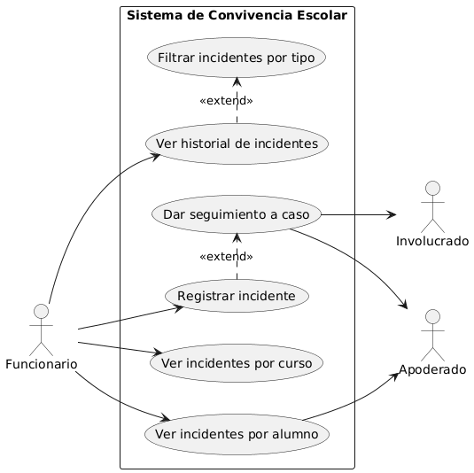

# Proyecto-Software2
 Implementación un sistema de software que apoye a un establecimiento educacional  para incidentes de convivencia escolar
## Requisitos funcionales 
* permitir registrar incidentes (funcionarios)
* mostrar historial (guardar incidentes) (funcionarios)
* permitir seguimiento de casos especificos (funcionario , involucrado y apoderado)
* mostrar incidentes por curso/alumno (funcionarios/apoderados para alumno)
* filtrar por tipo del incidente (funcionarios)
## Diagrama Casos de uso 

